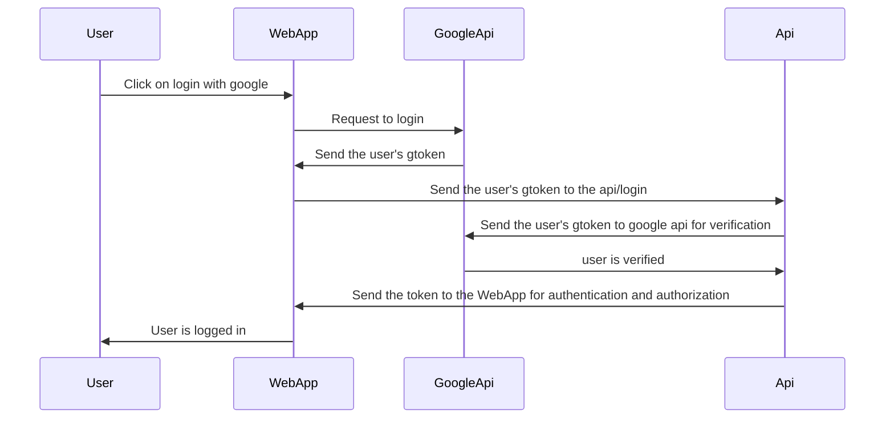

<div align=center>

# PcBuilds

</div>


<h3>General Info</h3>

PcBuilds is a web application that allows users to create and share their pc builds, it provides a way to search for components and compare them, it also provides a way to get the best prices for the components.


<br>

<div align=center>

## Architecture of the WebApp

<br>
<br>

</div>

### Frameworks and Technologies

<!-- react -->

<div align=center>


<br>

[React](https://react.dev/) a Javascript FrameWork for frontend development.
<br>
<br>

<!-- nodejs -->


<br>

[Node.js](https://nodejs.org/en/) a Javascript runtime for backend development.
<br>
<br>

<!-- Express -->


<br>

[Express](https://expressjs.com/) a Node.js framework for backend development (Api).
<br>
<br>

<!-- mysql -->


<br>

[Mysql](https://www.mysql.com/) a relational database management system.
<br>
<br>

<!-- bootstrap -->


<br>

[Bootstrap](https://getbootstrap.com/) a css framework for frontend development.
<br>
<br>


### Login/Register System

</div>
<br>

<!-- google login  -->

<div align=center>

</div>

<br>

[Google Login](https://developers.google.com/identity/sign-in/web/sign-in) is a google authentication service for login and register users in the app, it uses OAuth 2.0 protocol to authenticate users and get their information from google account providing a secure and easy way to login in the app, it also provides a way to get the user's email, name and profile picture.

<br>

<!-- google login in react -->
```
    import { GoogleLogin } from 'react-google-login';

    <GoogleOAuthProvider clientId="300229583546-cngao9upouq4souc4tree2umffabf9h5.apps.googleusercontent.com">
            <GoogleLogin
                onSuccess={credentialResponse => {

                    // the user is logged in and the credentialResponse contains the user's information
                
                }}
                onError={() => {
                
                    // an error occurred while trying to login the user

                }}
            />
    </GoogleOAuthProvider>
```
<br>

<div align=center>


</div>

<br>

### Api


The Api is a RESTful Api that provides the backend services for the WebApp, it uses Express to create the routes and handle the requests, it also uses Mysql to store the data, the api is also provided with a documentation with [Swagger](https://swagger.io/). The Api has a security layer that uses [JWT](https://jwt.io/) to authenticate and authorize the users.

<br>
Here an example of an endpoint that give the information about a cpu:


```javascript
routes.get('/components/cpus',VerifyToken('user'), async (req, res) => {

    try{

        connection.query('SELECT * FROM cpus', (error, results, fields) => {
            if (error){
                return res.status(500).json({message: "Internal server error", error: error});
            }

            if (results.length === 0){
                return res.status(404).json({message: "No cpus found"});
            }

            return res.status(200).json(results);

        });
    }catch(error){
        return res.status(500).json({message: "Internal server error", error: error});
    }
    
});
```

<br>

Here an example of a part of the swagger documentation that describes the endpoint above:

```yaml
openapi: 3.0.0
info:
  description: API for CRUD operation on pc builds
  version: 1.0.0
  title: PcBuilds
security:
  - bearerAuth: []
paths:
  /components/chipsets:
    get:
      summary: Get all chipsets
      operationId: GetAllChipsets
      tags: [Chipsets]
      responses:
        "200":
          description: Operation success
          content:
            "*/*":
              schema:
                type: array
                items:
                  $ref: "#/components/schemas/chipset"
        "404":
          description: Not Found
          content:
            "*/*":
              schema:
                type: object
                $ref: "#/components/schemas/error"
        "401":
          description: Unauthorized
          content:
            "*/*":
              schema:
                type: object
                $ref: "#/components/schemas/error"
        "500":
          description: Internal Server Error
          content:
            "*/*":
              schema:
                type: object
                $ref: "#/components/schemas/InternalError"
```
<br>

Here what the swagger documentation looks like in the browser:

<div align=center>


</div>


